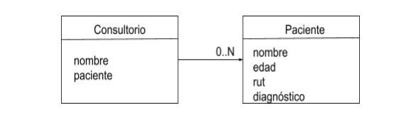

# Desafío Opcional - Creando y Modificando Objetos

## Descripción

Este desafío consiste en desarrollar un programa en JavaScript para un consultorio médico. El objetivo es crear un sistema que permita almacenar, modificar, buscar y mostrar datos de pacientes utilizando objetos. Se requiere implementar funcionalidades específicas como getters y setters para proteger los datos y métodos de búsqueda para filtrar pacientes por nombre.

## Requerimientos

1. **Crear Funciones Constructoras para Objetos**
2. **Implementar Métodos Getters y Setters**
3. **Crear Métodos para Buscar y Mostrar Datos**
4. **Instanciar Objetos Utilizando `new`**

## Diagrama UML

El diagrama UML proporcionado ilustra la estructura y cardinalidad de los objetos y sus propiedades. Puedes ver el diagrama aquí:

